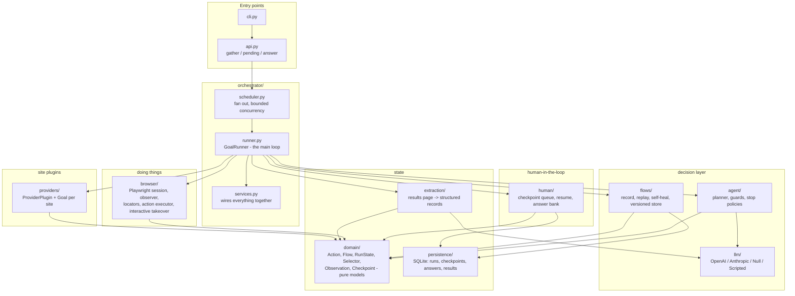
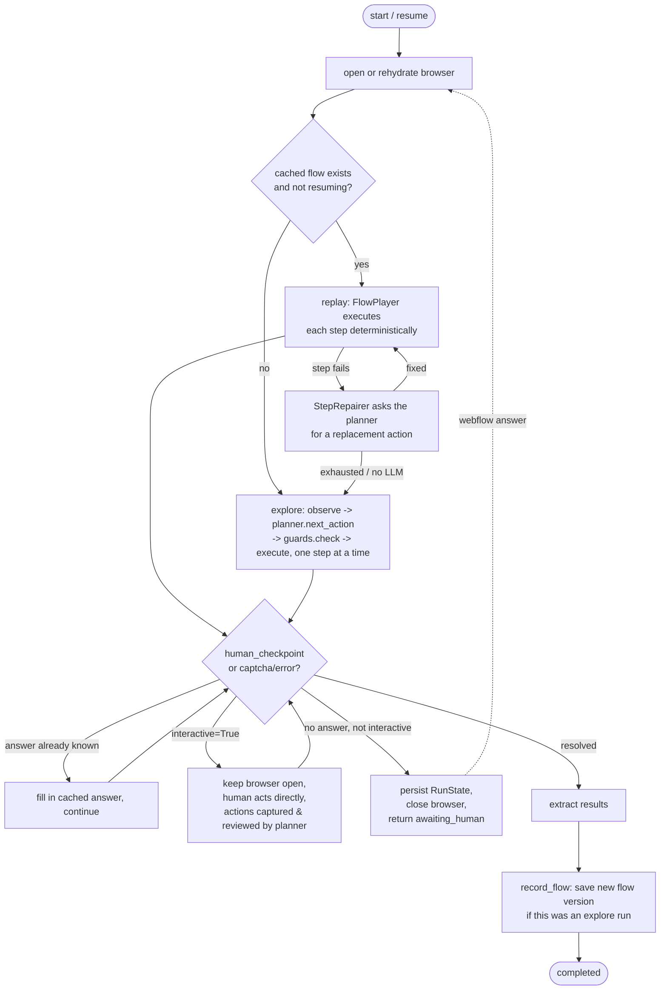

# Architecture

This is the reference doc for how `webflow` fits together. It's hand-maintained -
update it whenever a module's responsibility changes, a new layer is added, or the
execution flow changes in a way future-you would want to know about.

See [README.md](README.md) for install/usage. This file is about *how it works*.

## Layers

Each layer only depends on the ones below it. `domain` has no I/O at all; everything
else is built on top of it.

| Layer | Path | Responsibility |
| --- | --- | --- |
| Entry points | `src/webflow/cli.py`, `src/webflow/api.py` | Argument parsing / the three public verbs (`gather`, `pending`, `answer`). No behaviour lives here. |
| Orchestrator | `src/webflow/orchestrator/` | `GoalRunner` drives one goal end to end; `scheduler.py` fans out several concurrently; `services.py` wires dependencies (DB, LLM client, flow store). |
| Agent | `src/webflow/agent/` | `Planner` turns a page observation into one action via the LLM; `guards.py` enforces domain/irreversibility rules; `policies.py` enforces step/LLM-call budgets. |
| LLM | `src/webflow/llm/` | Provider-agnostic client. One `generate_structured` method shared by every vendor adapter, plus `NullLLMClient` (replay-only) and `ScriptedLLMClient` (tests). |
| Flows | `src/webflow/flows/` | `recorder.py` turns a successful run into a `Flow`; `player.py` replays one deterministically; `repair.py` asks the planner to fix a single broken step; `store.py` is the versioned `v<N>.json` file store. |
| Human | `src/webflow/human/` | `queue.py` suspends/answers runs; `resume.py` rebuilds a browser from `storage_state` and fast-forwards the replayable prefix; `answer_bank.py` remembers answers so a question is asked once. |
| Browser | `src/webflow/browser/` | `session.py` owns the Playwright browser/context/page; `observer.py` snapshots the page into a `PageObservation`; `locators.py` resolves a `SelectorSet` to a live element; `executor.py` is the single place an `Action` touches the page; `interactive.py` captures a human's clicks/fills during a take-over. |
| Domain | `src/webflow/domain/` | Pure pydantic models shared by every layer above: `Action` (discriminated union), `Flow`/`FlowStep`, `RunState`/`ExecutedStep`, `Selector`/`SelectorSet`, `PageObservation`, `CheckpointRequest`/`HumanAnswer`, `ValueSource`. No I/O, no Playwright import. |
| Extraction | `src/webflow/extraction/` | Turns a results page into a `ResultSet`, with an LLM fallback (`llm_extractor.py`) when heuristics (`heuristics.py`) don't recognise the layout. |
| Persistence | `src/webflow/persistence/` | SQLite-backed repositories for runs, checkpoints, answers and results (`data/runs.db`). |
| Providers | `src/providers/` | Site plugins. Each declares an `id`, `base_url`, one or more `Goal`s, and optional `prepare()`/`before_extract()` hooks (cookie walls, slow-loading results). |

## The main loop (`GoalRunner._drive`)

Three strategies, tried in order, all sharing the same `ActionExecutor`:

Key invariant: `ActionExecutor.execute()` in `browser/executor.py` is the *only*
place an `Action` is turned into a Playwright call. Replay, explore, repair and
interactive take-over all go through it, so there is exactly one execution
semantics to reason about.

## Interactive mode

Set `interactive=True` on `GoalRunner` (or `--interactive` on the CLI / `interactive=`
on `webflow.gather`/`webflow.answer`). Effects:

1. Forces a **headed** browser regardless of the `headless` setting.
2. Whenever a step would normally fail (`ActionExecutionError` /
   `LocatorResolutionError`) or a checkpoint would normally suspend the run,
   `GoalRunner._handle_takeover()` is called instead.
3. `InteractiveRecorder` (`browser/interactive.py`) injects a small script that
   captures clicks and field changes (passwords are never captured), shows a
   "Resume automation" banner, and blocks until you click it.
4. Captured DOM events are converted into ordinary `ClickAction`/`FillAction`
   objects (same `SelectorSet` machinery as everything else).
5. `Planner.review_demonstration()` asks the LLM which of those actions are
   worth keeping and for a one-line note; kept actions are appended to
   `run.trajectory` exactly like agent-driven steps, so they get folded into the
   learned flow the next time it's recorded or replayed.
6. The run then continues (replay/explore loop resumes) instead of suspending
   or failing.

Without an LLM configured (`NullLLMClient`), all captured actions are kept
verbatim - there's nothing to ask.

## Data model cheat sheet

- `Action` (`domain/actions.py`) - discriminated union: `goto`, `click`, `fill`,
  `fill_and_pick`, `select`, `check`, `press`, `upload`, `scroll`, `wait`
  (targeted/navigation) plus `extract`, `human_checkpoint`, `done` (control-only,
  never replayed against the page).
- `SelectorSet` (`domain/selectors.py`) - an ordered list of independent
  strategies (`test_id` > `role` > `label` > ... > `css` > `xpath`); the first
  one that resolves uniquely wins, and a working strategy gets promoted to the
  front for next time.
- `Flow` / `FlowStep` (`domain/flow.py`) - a versioned, replayable recording of
  one provider/goal, stored at `<flows_dir>/<provider_id>/<goal>/v<N>.json`.
- `RunState` / `ExecutedStep` (`domain/run.py`) - the full trajectory of one
  attempt, plus enough (`storage_state`, `last_url`, `answers`) to rebuild a
  browser and fast-forward through it later.
- `CheckpointRequest` / `HumanAnswer` (`domain/checkpoint.py`) - what the engine
  asks a human and what they said; fingerprinted so the same question is never
  asked twice.
- `ValueSource` (`domain/values.py`) - where a fill value comes from
  (`secret` > `answer` > `profile` > `literal`); resolved locally so the LLM
  never sees the actual value.

## Adding a site

Create `src/providers/<pack>/<site>/provider.py`, subclass `ProviderPlugin`,
declare `Goal`s, expose `PROVIDER = YourProvider()`. Discovery
(`providers/registry.py`) is automatic. No new engine code should be needed -
if it is, that's usually a sign something belongs in `domain/` or `agent/`
instead of the provider.

## Testing strategy

- `tests/unit/` - one concern per file (`domain`, `agent`, `flows`, `human`,
  `llm`, `preflight`); the LLM is always `ScriptedLLMClient` or `NullLLMClient`.
- `tests/integration/` - the full explore/suspend/resume/replay cycle against a
  local Playwright fixture page (`tests/fixtures/quote_form.html`), still
  offline.
- `tests/live/` - opt-in (`-m live`) tests against the real
  forsikringsguiden.dk DOM; run rarely, never in CI by default.
