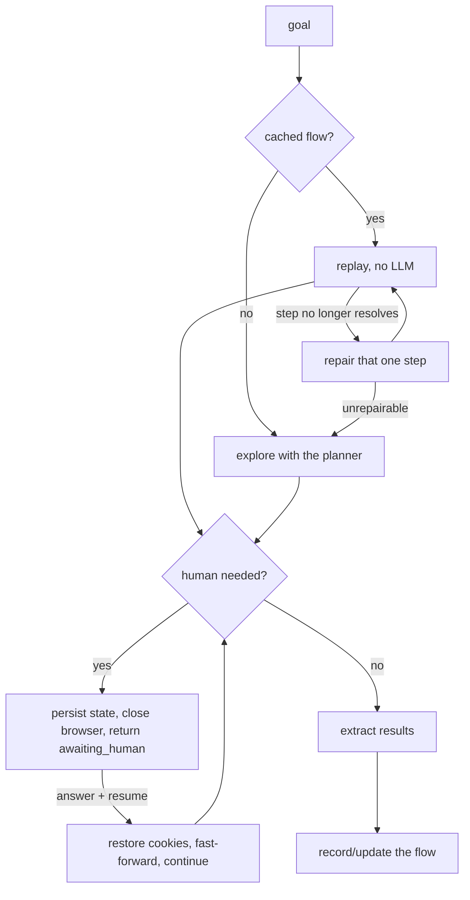

# webflow

A resumable, LLM-driven web-flow agent.

Give it a goal on a website that hides its answer behind a long form ("get me a car
insurance quote"). The first time, an LLM agent drives a real browser, filling fields
from your profile and **pausing into a persisted checkpoint** whenever a human is
genuinely needed. The browser is torn down while it waits, so nothing times out - you
can answer minutes or days later. On success the trajectory is saved as a versioned
JSON flow, and every subsequent run just replays it deterministically with **zero LLM
calls**.

Insurance quote comparison (forsikringsguiden.dk) is the first provider pack, but the
core engine is domain-agnostic.

See [ARCHITECTURE.md](ARCHITECTURE.md) for a full breakdown of how the pieces
fit together (component diagram, main loop, data model). This README is the
quick-start; that file is the one to update when the design changes.

## Status

Early MVP. A small CLI wraps the library (`webflow --help`); no REST API or UI
yet, but the layering leaves room for them.

What is actually verified so far:

| Area | State |
| --- | --- |
| Explore → suspend → resume → record → replay | Verified end to end, offline (`tests/integration`) |
| Observation, locators, action executor | Verified offline **and** against the live forsikringsguiden.dk DOM |
| Cookie wall, address autocomplete, advancing a page | Verified live (`pytest tests/live -m live`) |
| LLM adapters: request shape, JSON extraction, repair retry | Verified against a stubbed SDK (`tests/unit/test_llm.py`) |
| A real call to a real LLM | **Not yet run** - needs an API key |
| A full unattended run through to real quotes | **Not yet run** - needs an API key |

## Quick start checklist

Complete these steps before the first run:

- [ ] Install Python 3.12 or newer.
- [ ] Create and activate a virtual environment.
- [ ] Install the project with the LLM provider extra you plan to use.
- [ ] Install the Playwright Chromium browser.
- [ ] Copy `.env.example` to `.env` and add a working LLM API key.
- [ ] Set `WEBFLOW_LLM__PROVIDER` to `openai` or `anthropic`.
- [ ] Copy `profiles/profile.example.json` to `profiles/profile.json`.
- [ ] Replace the example personal and vehicle/home data in `profiles/profile.json`.
- [ ] Run the offline tests.
- [ ] Start one real run with a single target.

## Install

```powershell
py -3.14 -m venv .venv
.venv\Scripts\Activate.ps1
pip install -e ".[dev,openai]"
playwright install chromium
Copy-Item .env.example .env
Copy-Item profiles\profile.example.json profiles\profile.json
```

Use `pip install -e ".[dev,anthropic]"` instead if you want Anthropic rather
than OpenAI. Edit `.env` and set `WEBFLOW_LLM__API_KEY` to a real key. The
default provider is `null`, which is useful for replaying an already recorded
flow but cannot explore a new website.

## Run it

Installing the project (`pip install -e .`) registers a `webflow` command in
the virtual environment.

```powershell
webflow providers                                        # list providers/goals
webflow preflight forsikringsguiden/bilforsikring        # sanity-check config
webflow gather forsikringsguiden/bilforsikring           # run a target
webflow pending                                          # see paused runs
webflow answer RUN_ID --field annual_km=15000            # resume with an answer
```

The first run opens the real website and may pause for a human checkpoint;
`webflow gather` prints a summary including any runs now `awaiting_human`. Use
`webflow pending` to see what they need and `webflow answer` to resume once
you've decided. Pass `--headed` to `gather`/`answer` to watch the browser
instead of running headless, and `--no-probe-llm` to `preflight` to skip the
live (paid) model call.

Pass `--interactive` instead to watch *and* take over: the browser stays
visible, and whenever the agent would hit an error or need a human, control is
handed to you directly in the browser instead of pausing the run. Click
"Resume automation" when you're done - whatever you did is captured, reviewed
by the planner, and folded into the learned flow.

```powershell
webflow gather forsikringsguiden/bilforsikring --interactive
```

Available targets are `forsikringsguiden/bilforsikring`,
`forsikringsguiden/indboforsikring`, `forsikringsguiden/husforsikring`, and
`forsikringsguiden/ulykkesforsikring`.

The same three verbs are also available as a Python API for programmatic use
(see [Usage](#usage) below) - the CLI is a thin wrapper around `webflow.gather`,
`webflow.pending` and `webflow.answer`.

## Usage

Three verbs cover the whole system.

```python
import asyncio
import webflow

async def main():
    # 1. Ask for what you want. Targets are "<provider>/<goal>".
    batch = await webflow.gather(["forsikringsguiden/bilforsikring"])
    print(batch.summary())

    for outcome in batch.completed:
        for record in outcome.results.records:
            print(record.data)

asyncio.run(main())
```

If the agent hits something only you can decide, that run comes back as
`awaiting_human` while the others carry on. **The process can now exit.**

```python
# 2. Later - minutes, or next week - see what is blocked.
for question in await webflow.pending():
    print(question.describe())
# [3f2ab8c9d4e1] forsikringsguiden/bilforsikring (missing_profile_data)
#   Hvor mange km kører du om året? | fields: annual_km

# 3. Answer it. The run resumes in a fresh browser, restored to where it stopped.
outcome = await webflow.answer("3f2ab8c9d4e1", {"annual_km": "15000"})
print(outcome.results.records)
```

The answer is remembered: it goes into the answer bank *and* into
`profiles/profile.json`, so the same question is never asked twice. The
successful path is written to
`src/providers/insurance/forsikringsguiden/flows/bilforsikring/v1.json`, and the
next run replays it with no LLM calls at all.

### How a run decides what to do



### Human checkpoints

The agent stops for a human when - and only when - it should:

| Reason | Example |
| --- | --- |
| `missing_profile_data` | a required field with no profile value; it will not invent one |
| `ambiguous_question` | a question it cannot answer confidently |
| `captcha` / `mfa` / `login` | it cannot solve these; resume opens a headed browser |
| `consent` / `approval` | anything irreversible - buying, ordering, signing |
| `low_confidence` | it is stuck and wants a look |

Everything about a checkpoint is serialised - the question, the fields wanted, a
page excerpt and a screenshot - so it can be answered without a browser open.

### Privacy

The planner never sees your personal data. It is shown profile *keys* with
personal values redacted (`person.email = ***`) and replies with a key; the value
is substituted locally when the field is filled. That is also why recorded flows
contain no personal data and are safe to commit.

## Adding a site

Create `src/providers/<pack>/<site>/provider.py`, subclass `ProviderPlugin`,
declare your goals, and expose `PROVIDER = YourProvider()`. Discovery is
automatic - there is no list to register in. Optional `prepare()` and
`before_extract()` hooks handle cookie walls and slow-loading results.

## Layout

| Path | Purpose |
| --- | --- |
| `src/webflow/domain/` | Pure models: actions, selectors, flows, runs, observations. No I/O. |
| `src/webflow/browser/` | Async Playwright session, page observation, resilient locators, the one action executor, interactive take-over. |
| `src/webflow/llm/` | Provider-agnostic LLM client abstraction. |
| `src/webflow/agent/` | The exploration loop: planner, stop policies, safety guards. |
| `src/webflow/human/` | Checkpoints, the pending-intervention queue, resume, answer bank. |
| `src/webflow/flows/` | Record / replay / self-heal cached flows. |
| `src/webflow/extraction/` | Turn a results page into structured records. |
| `src/webflow/persistence/` | SQLite run history. |
| `src/webflow/orchestrator/` | End-to-end runner and concurrent scheduler. |
| `src/webflow/cli.py` | The `webflow` command-line entry point. |
| `src/providers/` | Site plugins. `insurance/forsikringsguiden` is the reference one. |
| `profiles/` | Your personal data, used to fill forms. `profile.json` is gitignored. |
| `data/` | Runtime state: `runs.db`, screenshots, traces. Gitignored. |

See [ARCHITECTURE.md](ARCHITECTURE.md) for how these pieces call into each
other and the full component diagram.

## Development

```powershell
ruff check src tests
mypy src
pytest              # live tests are excluded by default; run them with -m live
```

Tests run entirely offline: the browser drives a local fixture page and the
planner is a scripted stand-in, so the whole explore/suspend/resume/replay cycle
is verified without an API key or an internet connection.

